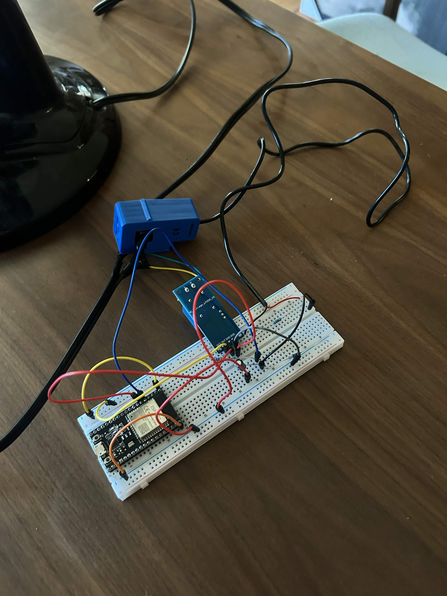
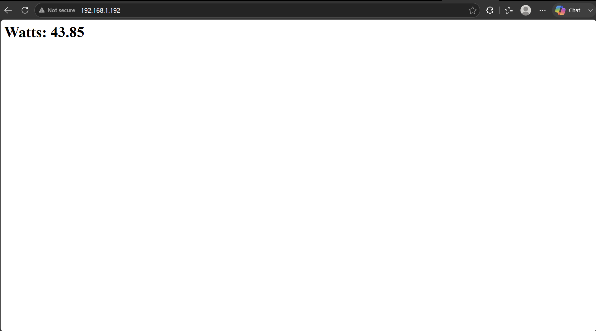
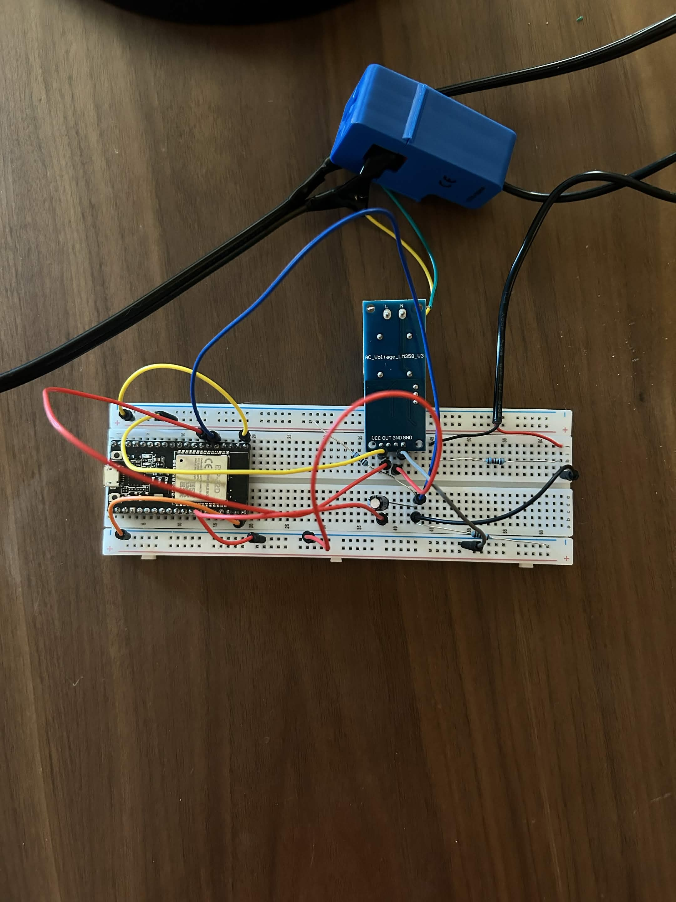

# ESP32 AC Power Monitor

A real-time AC power monitoring system built on an ESP32 microcontroller. Measures live wattage from any AC circuit and displays it on a WiFi-connected web dashboard accessible from any device on the same network.

# How it works

The SCT-013 current transformer clamps around a single wire and outputs a small AC current proportional to the current flowing through it. A 10Ω burden resistor converts that current to a voltage the ESP32 ADC can read. A bias circuit using two 10kΩ resistors and a 10µF capacitor lifts the signal to the ESP32's safe 0–3.3V range. The ZMPT101B voltage sensor taps across the AC line to measure voltage. Both signals are sampled 1000 times per cycle, RMS math is applied, and the results are multiplied to get watts. The ESP32 serves a live web dashboard over WiFi that updates every second.

# Parts list

ESP32 development board
SCT-013-000 100A current transformer
ZMPT101B AC voltage sensor
10Ω burden resistor
2× 10kΩ resistors (bias voltage divider)
10µF electrolytic capacitor
Breadboard and jumper wires
AC power cord for sensing

# Wiring

SCT-013 output → 10Ω burden resistor → bias circuit midpoint → GPIO34
Bias circuit: 10kΩ from 3.3V to midpoint, 10kΩ from midpoint to GND, 10µF cap from midpoint to GND
ZMPT101B: AC input terminals across hot and neutral, VCC → 3.3V, GND → GND, OUT → GPIO35

# Setup

Clone the repo and open 1_monitor_project.ino in Arduino IDE
Install ESP32 board support in Arduino IDE
Update ssid and password with your WiFi credentials
Upload to your ESP32
Open Serial Monitor at 115200 baud to find your ESP32's IP address
Visit the IP address in any browser on the same network

# Future improvements

Design a PCB in KiCad to replace the breadboard
Build into an enclosure with a built-in outlet so any device can be plugged in directly for monitoring
Add data logging to flash memory to track power usage over time
Add threshold alerts via email or webhook when wattage exceeds a set limit
